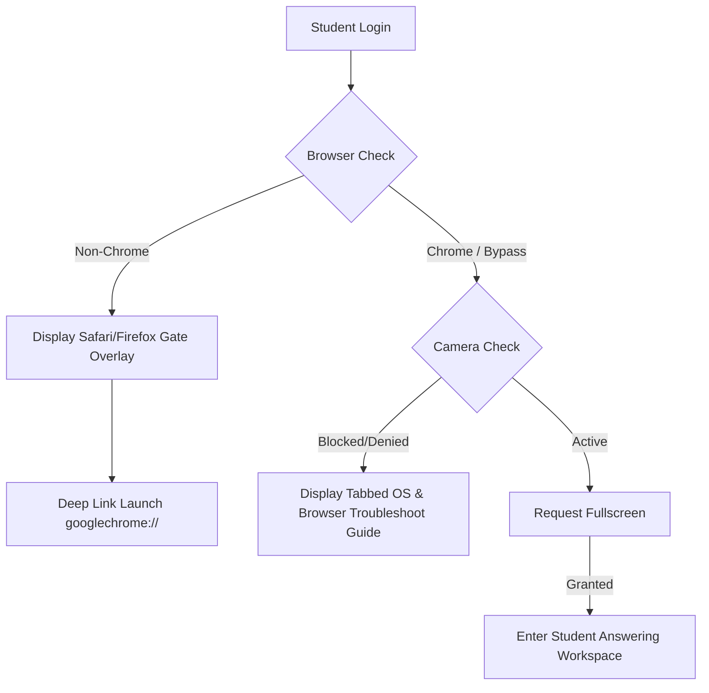
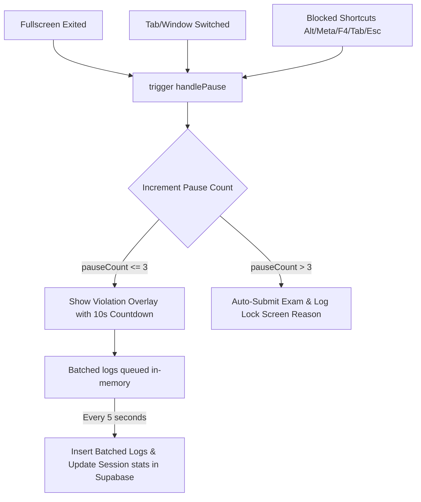

# Prav-AI — Proctored Skill & Knowledge Assessment Platform

Prav-AI is a lightweight, secure, and state-of-the-art online assessment platform designed to deliver high-scale proctored exams with minimal network and client overhead. The platform combines real-time browser gating, device permission guidance, and automated batch-log synchronization.

---

## 1. System Architecture & Pipelines

### 🔐 Student Authentication & Gating Pipeline
Before starting an assessment, student environments are verified through browser controls and hardware permissions.



### 🛡 Proctoring & Violation Enforcement Pipeline
During the examination, activity indicators route through a centralized batching controller.



---

## 2. Core Working Components

### 🌐 Browser Gating & Redirection
- **Default Engine**: Limits exams to Google Chrome (Chromium derivatives) to bypass Safari/Firefox-specific media stream permission locks.
- **Deep Linking**: Offers a redirection link using the `googlechrome://` protocol scheme to automatically launch Chrome if installed locally.

### 📷 Persistent Camera Lifecycle
- **Unified Video DOM**: Mounts a single persistent video element that transitions from a 1px hidden buffer to the card container, completely preventing the `AbortError` stream play failures typical of conditional React unmounting.
- **Troubleshooting Guides**: When permission is denied, tabbed OS guides (macOS System Settings vs. Windows Settings) and browser guides (Chrome, Safari, Firefox permissions) are rendered to help students unblock their cameras.

### ⏱ Global 3-Pause Auto-Submit
- **Pause Aggregation**: Tracks tab switches, unauthorized shortcut keys, and fullscreen exits.
- **Auto-Submission**: If the exam is paused **more than 3 times** (the 4th pause event), the exam is immediately auto-submitted, queued logs are flushed, and a proctor lock screen is displayed detailing the incident.

### ⚡ Concurrency & Performance Optimizations (100+ Students)
Designed to run lag-free on low-spec laptops with minimal bandwidth usage:
- **Bandwidth Reduction (90%+ Savings)**: Webcam snapshot canvas dimensions are downscaled to `160x120` with a JPEG quality factor of `0.5`, decreasing snapshot uploads to **under 5 KB** per image (down from 60 KB).
- **Zero Layout Thrashing**: Active 3-second DevTools interval polling checks with a passive window `resize` event listener. Bounds are checked only when dimensions shift, eliminating CPU footprint during typing.
- **Database Write Batching**: Tab switches, fullscreen exits, and DevTools events are counted in-memory using React refs, and synced to Supabase in a single merged update **every 5 seconds**.

---

## 3. Getting Started

### Prerequisites
- Node.js (v18 or higher)
- Supabase Database URL & Anon Keys (configured in `.env.local`)

### Installation
```bash
# Clone the repository
cd testera

# Install dependencies
npm install

# Run the development server
npm run dev
```

### Production Build
```bash
# Verify TypeScript, ESLint, and compile Next.js production bundle
npm run build
```

---

## 4. Future Work & AI Automations

The following modular pipelines are planned to expand proctoring capabilities without increasing server load:

### 👤 Face Match & Identity Verification
- **Process**: Capture a webcam snapshot at the start of the assessment and compare it to a pre-registered student photograph.
- **Implementation**: Run a client-side face recognition model (such as `face-api.js` or TensorFlow.js WebGL) in the browser to compute facial similarity vectors, keeping calculations local and lightweight.

### 👁 Gaze Tracking & Eye Mesh
- **Process**: Verify that the student is consistently looking at the screen during exam execution.
- **Implementation**: Deploy a lightweight browser-based facial landmark model (`MediaPipe Face Mesh` or `TFJS BlazeFace`) to detect pupil movement and gaze directions locally, updating database metrics only if deviations cross acceptable thresholds.

### 📱 Server-Side Object Detection
- **Process**: Analyze randomized webcam snapshots on the backend/server to identify unauthorized mobile phones, secondary displays, or multiple faces in the frame.
- **Implementation**: Execute lightweight `YOLOv8-nano` or MobileNet object detection checks asynchronously on uploaded snapshots, flagging high-probability violations on the admin panel's monitor board.
